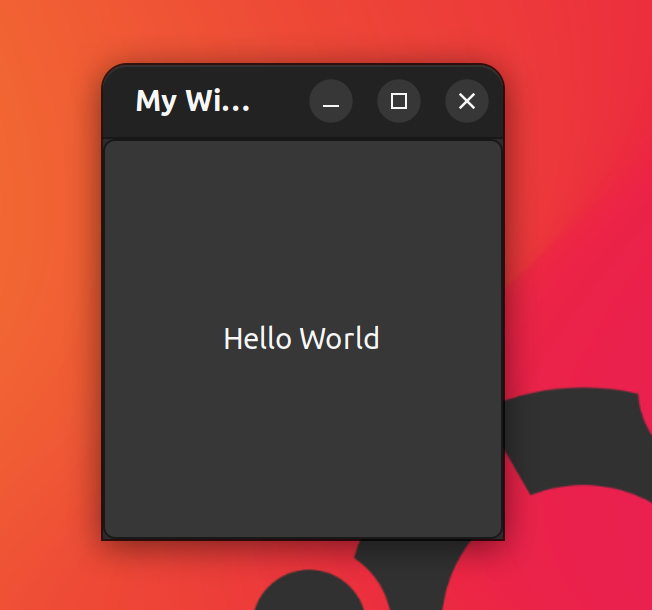

# MOSER

The Mole's own Script execution runtime (M.O.S.E.R.).

<p align=right><i><small>dedicated to E.M., for everything.</small></i></p>


Moser is an academic study of [Crafting Interpreters](https://craftinginterpreters.com/) fame. Technically Moser is a C++ port of the VM based Interpreter *Lox* which is implemented in the second part of this wonderful book. Like Lox, Moser is a Javascript/Python hybrid scripting language powered by running bytecode in a virtual machine. Moser supports a large subset of Lox and for the most part, Syntax follows the [Lox](https://craftinginterpreters.com/the-lox-language.html) example.

## Warning: MOSER is not intended for production usage.

<i>did I say it is an academic exercise?</i>

# Changes Version 1.2 (March 2025)
- Coroutine support (async functions)
- Simple Media Layers (SDL2) example


<br>
<br>

# Major Aims of this Effort

- Implementation of a scripting VM based on bytecode
- Native interop in the spirit of .NET CLRs Platform Invoke (which itself of course is in the spirit of VB6's Declare Function), including suppoer for event driven async programming
- Displaying native Desktop UI from script
- Some helpful Basics like Arrays and Maps (like Javascript Object), JSON support, Regular Expressions, Metadata (Annotations), runtime import and eval.

# Basic Moser Syntax

Here is [fizzbuzz](https://wiki.c2.com/?FizzBuzzTest) written in MOSER:

```js

fun fizzbuzz(i)
{
    var dividableBy3 = i % 3 == 0;
    var dividableBy5 = i % 5 == 0;

    if( dividableBy3 && dividableBy5 )
    {
        print "fizz buzz";
    }
    else if( dividableBy3 )
    {
        print "fizz";
    }
    else if( dividableBy5 )
    {
        print "buzz";
    }
    else print i;
}

var n = 20;
if( sys.args().length > 2) n = int( sys.args()[2] );

for( var i = 1; i <= n; i++)
{
    fizzbuzz(i);
}

```

# Major Changes to Lox Syntax

Moser Syntax follows Lox [syntax](https://craftinginterpreters.com/appendix-i.html) with the exception of indiciting inheritance: While Lox uses '>' as a separator in Class declarations to indicate the base (super) class, Moser uses ':' like Java or C##.

Moser has support for for and while loops, including break and continue functionality. Moser has a rudimentary throw exceptions mechanism, including catch and finally constructs.

Moser comes with two major builtin data structures - Array and Map (Object), allowing for a native JSON implementation.

For a full list of Moser's handful builtin objects and functions see [builtins](doc/builtin_objects.md) and [native lib](doc/native_lib.md)


<br>
<br>

# Native OS Integration

Moser supports native OS integration by providing a foreign function interface to call into system libraries (.DLLs on windows, .so on Linux) based on [libffi](https://github.com/libffi/libffi).

- import C functions, including variadic ones
- declare and use C style structs
- declare and use C style callback functions and function pointers
- call a COM interface function (Win only)
- use COM IDispatch based interfaces (Win only)

[link to native code decl]

<br>
<br>

## Example C stdio code

  ```js
extern {
    ptr fopen( str, str );
    ulong fread( ptr, ulong, ulong, ptr );
    int fclose( ptr );
}

var filename = io.self(); 
var file = fopen(filename, "rb" );

var buf = sys.buffer(1024);
var content = "";

var r = 1;
while(r > 0)
{
    r = fread( buf, 1, 1024, file);
    content = content + buf.asString(r);
}

print content;

fclose(file);
```

## Installing MOSER

Binary Releases avail on GitHub.

### Debian/Ubuntu

There is a simple .deb package that you can
install on debian systems like 

```bash
dpkg -i moser_1.0_amd64.deb
```

Download the .dev package from current github release: [release](https://github.com/littlemole/moser/releases)

sha256 
562339a727008c688fc9ee310e0822ce4f93e8ea8e155ab7740a59f261d18dd5 [virustotal](https://www.virustotal.com/gui/file/562339a727008c688fc9ee310e0822ce4f93e8ea8e155ab7740a59f261d18dd5/detection)


### Windows 10/11

Xcopy and .msi releases are available.

- the XCopy release brings a full moser installation you can extract everywhere, but here is no PATH or filetype registration. You have to run MOSER from the cmd line and call MOSER with full or relative path. <br>
XCopy Download: [moser.zip](https://github.com/littlemole/moser/releases) 
sha256 4c4d179ade58655241f7edf0ddaf779f761b753c1346187ac7a26632f6a16026 
- the .msi installer allows to install MOSER to a destination of your liking. In addition to an XCopy install, it will patch %PATH% to include the MOSER install directory, and register .msr file extension to be run through the MOSER executable, allowing to click on .msr scripts that launch a UI. <br>
MSI Download: [moserSetupPerUser.msi](https://github.com/littlemole/moser/releases) 
sha256
a39d3efed19d1b05b2463c4dec8387f206df6b9d954f6b47f68f4a6833239ce8 [virustotal](https://www.virustotal.com/gui/file/a39d3efed19d1b05b2463c4dec8387f206df6b9d954f6b47f68f4a6833239ce8)


note that on Windows, there are two executables following the Windows tradition of providing two executables for console or GUI interaction:
- moser.exe is a console application, always shows a console, and has good support for console IO
- xmoser.exe is a windows application. It will attach to console if launched from a console window, which allows for output on the console, but console input is a mess. if called in REPL mode (no arguments) it will launch a new console. If launched otherwise - like clicking on a .msr file from Explorer - it will NOT launch a console. Only xmoser.exe has support for WinUI / XAML Features. Classic Win32 UI (Petzold style) and even non-ui WinRT is also supported via moser.exe.


## Building MOSER

see [Linux Build](doc/build_linux.md) and
    [Windows Build](doc/build_win.md)
for build and pre-requisite instructions.

## Linux Examples

see directory linux

### curl

demonstrates nedtworking using libcurl.

### gtk

demonstrates simple ad-hoc usage of GTK3 libs.

  

- gtk_simple.msr : demonstrates a minimal GTK3 Hello World example
- md5.msr : UI to compute md5 hash of chosen file using shell-out (popen)
- hash.msr : computes common hashes of chosen files using openssl
- builder.msr : demonstrates using GtkBuilder to construct a simple UI from xml markaup.
- ui.msr : demonstrates a simple GTK3 UI using GtkBuilder and the local "gtk" lib

### gtk3

demonstrates using gtk via c-style bindings generated with gnome object introspection (gir).

### gtk4

same as gtk3 but for GTK version 4

### diff

Git diff viewer using runtime gnome object introspection similar to pgtk or vala bindings
  

### dot

 Dotfiles editor using runtime gnome object introspection similar to pgtk or vala bindings
 and demonstrating creating new GObject objects from moser.
  

### soup

Gnome soup networking examples, including async io. New in Version 1.2: Coroutine (async) function support.
Snippet from the [coro_soup.msr](./Linux/soup/coro_soup.msr) example:

```
async fun fetch_async(session,msg) {

    var ptr = await session.async_send_and_read(msg,0,0);
    var result = GLib.Bytes(ptr);

    var content = result.get_data(0);
    print content.string();
}
```

### eve
async io using libevent

### openssl
crypto with openssl

## windows examples

see directory win32/examples

### hash.msr
cli file hashing using ms crypto libs

### petzold.msr
simple Petzold style win32 api windowing

  

### stdin.msr
read from stdin

###  stdio.msr
c style stdio on win32

### stdmath.msr
using c stdlib math functions in moser

### winrttest.msr
some examples / playground for winRT invocations

### win32

- encDlg.msr shows using win32 dialog resources from a resource only DLL   
- hash32.msr computes file hashes in a Petzold style Win32 UI   
- hex32.msr shows file contents in a classic hexview, Petzold style UI   
- hmac32.msr computes HMACs using Win32 UI
- iconWnd.msr just prints icons from a resource DLL   
- mocpad.msr demonstrates basic mini text editor features   

### disp
demonstrates using IDispatch based COM Apis from moser.

- fso.msr uses FileSystemObject from WIndows Scripting Host
- msxml.msr uses msxml for xml parsing
- xhr.msr uses XmlHttpRequest for HTTP requets similar to JavaScript
- excel.msr demonstrates Office automation

### xaml

- dot implements a simple dot file (graphviz) editor in XAML
  
- xpad implements a basic XAML editor with preview   
- mopad implements most basic notepad functionality in XAML
- hash.msr computes file hashes offering a XAML UI
  
- mochrome.msr and mohtml.msr demonstrate using WebView2 in a moser XAML app
- simple_xaml.msr just shows basic XAML embedding

New in Version 1.2:
the [mopad2.msr](./win32/examples/xaml/mopad2.msr) example features coroutine (async) function.

# Windows impl extra deps

see directory win32

- idl is used to extract c/c++ headers from winrt idl

- mocres demonstrates an example resource only DLL used by win32 examples (dialogs, icons)

- moxaml brings in native support for XAML hosting

- test includes integration tests for win32

- winmd re-generates idl from winmd files

- winmeta has cupport for reading winmd meta files and create moser bindings for
    * metamoc generates WinRT bindings
    * winmetamoc generates Win32 bindings

 - winui is a simple WinUI example app used to ripp all the dependencies that then can be used from moser to play with WinUI. the only feature ever used is to expand xaml into the window titlebar ...

 - wix contains code for creating a MSI installer using the WIX toolkit
